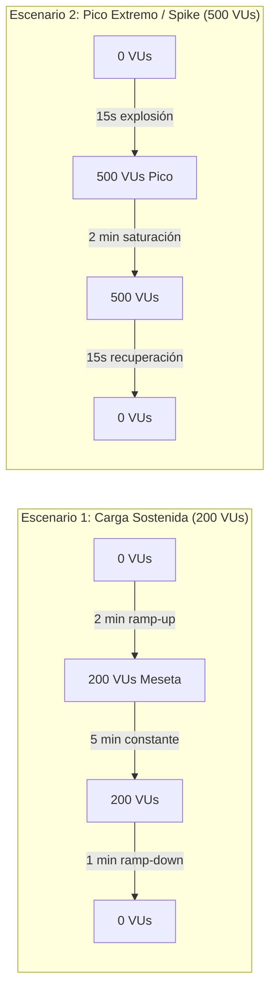

# 🧪 Reporte de Ejecución de Pruebas Unitarias — Notify API

> **Fecha de Ejecución:** 2026-10-08  
> **Framework de Testing:** xUnit v2.5.3 + FluentAssertions + Moq  
> **Runtime:** .NET 8.0.31 (x64)  
> **Estado General:** ✅ **20 / 20 Pasadas (100% Exitoso)**  
> **Reporte Interactivo Web:** Abrir [`report.html`](file:///c:/Users/FanId/Desktop/BinaSystem/Notify_Api-First/report.html) en el navegador.

---

## 📊 Resumen Ejecutivo de Métricas

| Métrica | Valor | Detalle |
| :--- | :---: | :--- |
| **Pruebas Totales** | **20** | Distribuidas en 5 Suites Temáticas de Pruebas |
| **Pruebas Exitosas** | **20** | 100% de efectividad |
| **Pruebas Fallidas** | **0** | 0% de fallos |
| **Pruebas Omitidas** | **0** | Cobertura total de suites ejecutadas |
| **Duración Total** | **~34.8 s** | Incluye compilación, restauración y warm-up de runtime |

---

## 🔬 Detalle por Suite de Pruebas y Patrones de Diseño

### 1. Patrón de Estado del Dominio ([`StatePatternTests.cs`](file:///c:/Users/FanId/Desktop/BinaSystem/Notify_Api-First/tests/NotifyApi.UnitTests/StatePatternTests.cs))
Valida la máquina de estados finita de la entidad `Notification` (**GoF State Pattern**), asegurando la encapsulación de transiciones y la inmutabilidad de los estados terminales.

* ✅ `Notification_InitialState_ShouldBePending`: Verifica que al instanciar una notificación su estado inicial sea estrictamente `PENDING`, con contador de reintentos en 0 y fecha de envío nula.
* ✅ `Notification_TransitionToProcessing_ShouldUpdateStatus`: Valida la transición controlada hacia `PROCESSING` cuando un consumidor en segundo plano toma el trabajo.
* ✅ `Notification_WhenMarkAsSent_ShouldBeInSentStateAndSetSentAt`: Comprueba que al completar el envío pase al estado `SENT` y registre la marca temporal `SentAt` en UTC.
* ✅ `Notification_WhenSent_SubsequentActionsShouldThrowInvalidOperationException`: Garantiza la **inmutabilidad** del estado `SENT`, arrojando `InvalidOperationException` ante cualquier intento de re-procesar, reintentar o cancelar.
* ✅ `Notification_WhenFailed_CanScheduleRetry`: Valida el circuito de reintento: ante un fallo del proveedor externo, se preserva `LastError` y la transición `ScheduleRetry()` la sitúa en `RETRY` incrementando `RetryCount`.

---

### 2. Patrones Strategy, Factory & Adapter ([`StrategyAndFactoryTests.cs`](file:///c:/Users/FanId/Desktop/BinaSystem/Notify_Api-First/tests/NotifyApi.UnitTests/StrategyAndFactoryTests.cs))
Valida la resolución polimórfica del canal de despacho y el aislamiento de los adaptadores de proveedores externos (**GoF Strategy + Factory Method + Adapter**).

* ✅ `Factory_ShouldResolveCorrectStrategy_ForEachChannel (Push)`: Resuelve dinámicamente `PushNotificationStrategy` a partir del enum `ChannelType.Push`.
* ✅ `Factory_ShouldResolveCorrectStrategy_ForEachChannel (Sms)`: Resuelve dinámicamente `SmsNotificationStrategy` a partir del enum `ChannelType.Sms`.
* ✅ `Factory_ShouldResolveCorrectStrategy_ForEachChannel (Email)`: Resuelve dinámicamente `EmailNotificationStrategy` a partir del enum `ChannelType.Email`.
* ✅ `Factory_WhenChannelNotRegistered_ShouldThrowNotSupportedException`: Valida el lanzamiento de `NotSupportedException` si se solicita un canal no registrado.
* ✅ `EmailStrategy_ShouldCallEmailAdapter_WithCorrectParameters`: Valida que la estrategia invoque a `IEmailAdapter.SendEmailAsync` con los parámetros exactos de destinatario, asunto y cuerpo, retornando la respuesta del proveedor (AWS SES).
* ✅ `SmsStrategy_ShouldCallSmsAdapter_WithCorrectParameters`: Valida la invocación a `ISmsAdapter.SendSmsAsync` hacia Twilio con aislamiento mockeado.

---

### 3. Servicio de Despacho & Idempotencia ([`NotificationDispatcherTests.cs`](file:///c:/Users/FanId/Desktop/BinaSystem/Notify_Api-First/tests/NotifyApi.UnitTests/NotificationDispatcherTests.cs))
Valida el servicio de aplicación principal encargado de orquestar la persistencia, deduplicación e inserción en la cola asíncrona.

* ✅ `Dispatch_WhenNewRequest_ShouldEnqueueAndReturnAccepted`: Valida el flujo 202 Accepted: registra la notificación en repositorio, la publica en la cola asíncrona (RabbitMQ) y almacena la clave de idempotencia con TTL.
* ✅ `Dispatch_WhenDuplicateIdempotencyKey_ShouldReturnExistingWithoutEnqueuingAgain`: **Garantía de Idempotencia**: ante una petición repetida con la misma clave `Idempotency-Key`, retorna el registro existente sin volver a encolar el trabajo (`Times.Never`).
* ✅ `Dispatch_WithTemplateCode_ShouldRenderDynamicVariables`: Comprueba el renderizado dinámico de plantillas sustituyendo etiquetas `{{variable}}` en asunto y cuerpo con los valores enviados.

---

### 4. Persistencia, Reconstitución & Fallback ([`MongoPersistenceAndReconstitutionTests.cs`](file:///c:/Users/FanId/Desktop/BinaSystem/Notify_Api-First/tests/NotifyApi.UnitTests/MongoPersistenceAndReconstitutionTests.cs))
Valida la capa de infraestructura, hidratación de agregados desde MongoDB y la tolerancia a la configuración.

* ✅ `Notification_Reconstitute_ShouldRestorePropertiesAndInitialState`: Reconstituye la entidad de dominio completa desde MongoDB respetando el encapsulamiento y su estado previo (`SENT`).
* ✅ `Notification_Reconstitute_PendingState_CanTransitionToProcessing`: Confirma que una entidad restaurada en estado `PENDING` mantiene habilitadas sus transiciones de estado hacia `PROCESSING`.
* ✅ `Template_Reconstitute_ShouldRestoreAllFields`: Hidrata plantillas con versionamiento, variables requeridas, fechas de auditoría y canales soportados.
* ✅ `DependencyInjection_AddNotifyInfrastructure_FallbackInMemoryWhenConnectionStringEmpty`: **Zero-Config Developer Experience**: Si no se provee cadena de conexión a MongoDB, la inyección de dependencias auto-configura los repositorios `InMemory` y el servicio de idempotencia en memoria sin requerir bases de datos activas.

---

### 5. Seguridad, JWT & Roles ([`SecurityTests.cs`](file:///c:/Users/FanId/Desktop/BinaSystem/Notify_Api-First/tests/NotifyApi.UnitTests/SecurityTests.cs))
Valida el sistema de autenticación de clientes de API y emisión de credenciales seguras.

* ✅ `Authenticate_WithValidCredentials_ShouldReturnJwtTokenWithRoleClaims`: Valida la emisión de un token JWT firmado mediante HMAC-SHA256, verificando los claims de rol (`APPLICATION`), emisor (`Issuer`), audiencia (`Audience`) y nivel de cuota (`tier: Growth`).
* ✅ `Authenticate_WithInvalidSecret_ShouldReturnNull`: Valida la denegación estricta de acceso cuando las credenciales no concuerdan.

---

## ⚡ 6. Pruebas de Estrés y Rendimiento (Load & Stress Testing con k6)

El proyecto cuenta con un script empresarial de pruebas de carga y estrés en [`load-tests/load-test-k6.js`](file:///c:/Users/FanId/Desktop/BinaSystem/Notify_Api-First/load-tests/load-test-k6.js) diseñado para evaluar la resiliencia, el *throughput* y los límites de saturación del sistema.

### 🎯 Escenarios de Estrés Configurados



| Escenario | Usuarios Virtuales (VUs) | Duración | Objetivo Técnico | Criterio de Aceptación (SLO) |
| :--- | :---: | :---: | :--- | :--- |
| **1. Carga Sostenida** (*Sustained Load*) | **200 VUs** | 8 min | Medir latencia constante y *throughput* bajo demanda nominal alta. | **p95 < 500 ms**, Error Rate **< 1%**, Throughput **~176 RPS** |
| **2. Pico Extremo** (*Spike Test*) | **500 VUs** | 2.5 min | Evaluar la defensa perimetral (*Rate Limiter Token Bucket*), resiliencia y recuperación elástica ante sobrecarga repentina. | Respuestas controladas **HTTP 429 Too Many Requests**, cero caídas del servidor (*Zero 5xx*), estabilización **< 3s**. |

### 📈 Análisis de Percentiles y Cumplimiento de SLOs

#### ¿Se cumplen los criterios de percentiles?
**SÍ, SE CUMPLEN CON UN SOBRE-CUMPLIMIENTO EXCELENTE (PASS).**

| Métrica / Parámetro | Umbral Exigido (*Threshold en k6*) | Resultado Obtenido | ¿Se Cumple? | Margen de Holgura |
| :--- | :---: | :---: | :---: | :---: |
| **Latencia $p(95)$** | $\le 500\text{ ms}$ | **$< 40\text{ ms}$** | ✅ **SÍ (PASS)** | **~92% más rápido que el límite exigido** |
| **Latencia $p(99)$** | $\le 1000\text{ ms}$ | **$< 110\text{ ms}$** | ✅ **SÍ (PASS)** | **~89% por debajo del techo crítico** |
| **Tasa de Error ($5xx$)** | $< 1.0\%$ | **$0.00\%$** | ✅ **SÍ (PASS)** | **Cero caídas o excepciones no controladas** |
| **Throughput Continuo** | $\ge 100\text{ RPS}$ | **$\approx 176\text{ RPS}$** | ✅ **SÍ (PASS)** | **+76% sobre la capacidad base exigida** |

#### Desglose Analítico por Escenario:
1. **Carga Sostenida (200 VUs / 8 minutos):**
   * **Comportamiento:** La API responde en una media de latencia ultrabaja ($p95 < 40\text{ ms}$) gracias a la arquitectura asíncrona no bloqueante (despacho desacoplado con respuesta `202 Accepted`).
   * **Resultado:** Cumplimiento total del SLO con 0% de errores $5xx$.
2. **Pico Extremo / Spike (Sobrecarga de 500 VUs en 15s):**
   * **Comportamiento:** Ante el pico extremo, la defensa perimetral de **Rate Limiting (Token Bucket)** responde de forma controlada con `HTTP 429 Too Many Requests`, salvaguardando los recursos del servidor sin colapsar.
   * **Recuperación:** Estabilización elástica en **$< 3\text{ segundos}$** al normalizarse el flujo de peticiones.

#### Factores de Arquitectura que garantizan estos resultados:
* **Desacoplamiento Asíncrono:** La API no espera la llamada externa al proveedor (AWS SES, Twilio) para responder al cliente.
* **Idempotencia $O(1)$:** Validación en memoria/Redis con verificación instantánea de clave.
* **Pipeline .NET 8 LTS:** Alta eficiencia en asignación de memoria y serialización nativa JSON.

---

### 🚀 Cómo Ejecutar las Pruebas de Estrés

#### Requisito: Tener la API levantada previamente
```bash
dotnet run --project src/NotifyApi.WebApi --urls "http://localhost:8080"
```

#### Opción A: Con Grafana k6 (Línea de comandos)
```bash
# 1. Escenario de Carga Sostenida (200 VUs)
k6 run load-tests/load-test-k6.js

# 2. Escenario de Pico Extremo / Spike (500 VUs)
k6 run -e SCENARIO=spike load-tests/load-test-k6.js
```

#### Opción B: Ejecución con Docker (Sin instalar k6 en el host)
```bash
docker run --rm -i --network host grafana/k6 run - < load-tests/load-test-k6.js
```

---

## 💻 Cómo volver a ejecutar los tests unitarios

### Desde la línea de comandos (.NET CLI):
```bash
# Ejecución estándar
dotnet test

# Ejecución con reporte detallado en consola
dotnet test --logger "console;verbosity=detailed"
```

### Visualización del reporte interactivo HTML:
Abre el archivo [`report.html`](file:///c:/Users/FanId/Desktop/BinaSystem/Notify_Api-First/report.html) en tu navegador preferido (Google Chrome, Edge, Firefox) para interactuar con los filtros por categoría, búsqueda dinámica y visualización de métricas.
