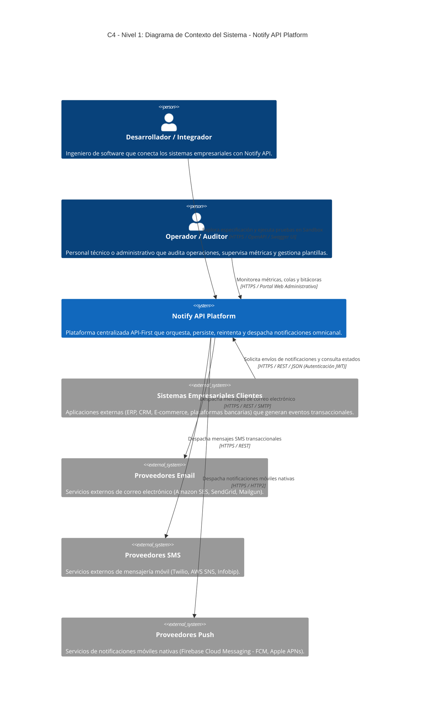
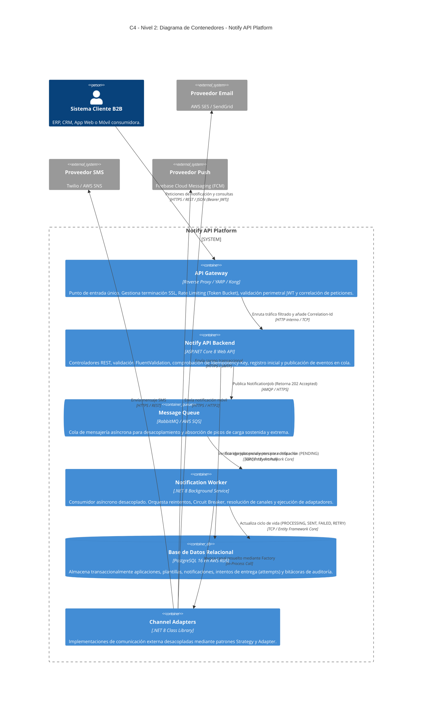
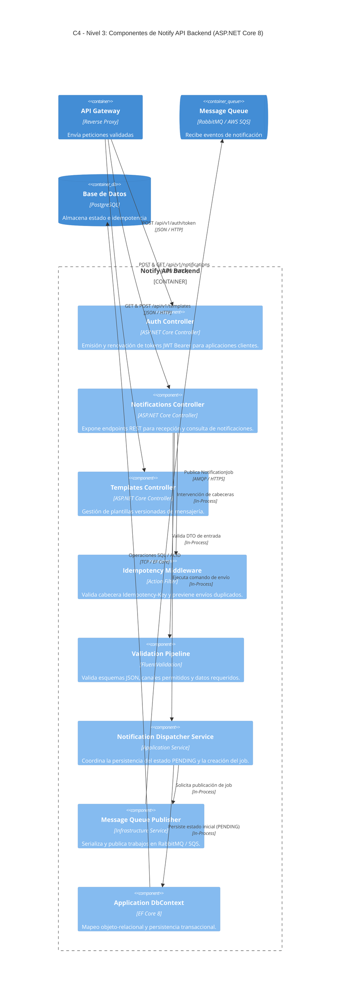
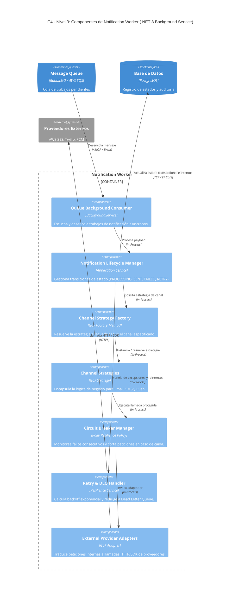
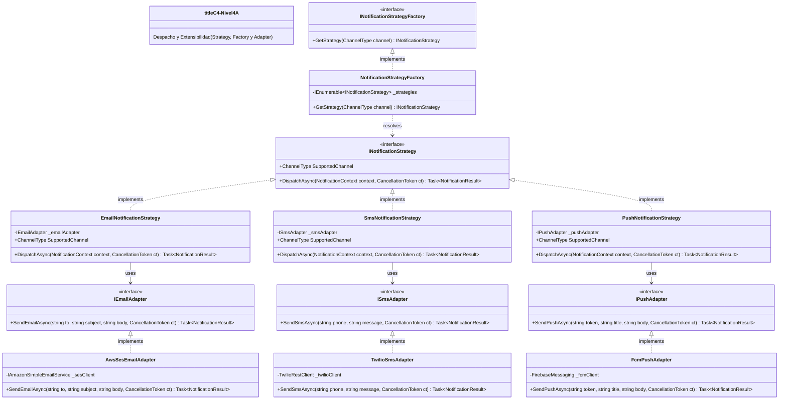
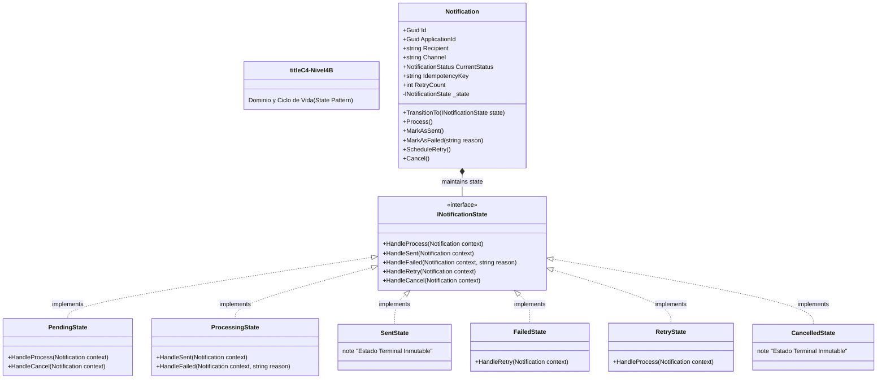
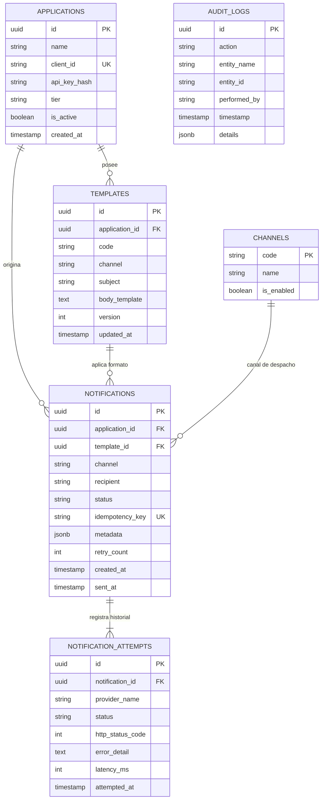

# Fase 2: Arquitectura y Patrones

---

# 1. Portada y Control del Documento

## Información General
* **Nombre de la API / Producto:** Notify API
* **Organización:** Consultoría de Software
* **Fase:** Fase 2 — Arquitectura y Patrones (Resultado de Aprendizaje 2 - RA2)
* **Versión:** 1.3.0
* **Fecha de Emisión:** 2026-10-02
* **Estado:** Aprobado para Implementación
* **Autores:**
  * Christian Naranjo — Ingeniero de Software
  * Jordy Loor — Ingeniero de Software
  * Diego Mesias — Ingeniero de Software

## Historial de Revisiones
| Versión | Fecha | Autor | Resumen del Cambio |
| :--- | :---: | :--- | :--- |
| **v0.1** | 2026-09-18 | C. Naranjo | Estructura inicial y comparativa de estilos arquitectónicos (REST, GraphQL, gRPC). |
| **v0.2** | 2026-09-22 | J. Loor | Definición preliminar de patrones GoF, colas y componentes. |
| **v1.0** | 2026-09-26 | D. Mesias | Incorporación de patrones de resiliencia (Circuit Breaker, Idempotencia) y Clean Architecture. |
| **v1.1** | 2026-10-02 | Equipo Notify | Unificación de propuestas, alineación con Fase 1 y adopción inicial de C4 (Niveles 1 y 2). |
| **v1.2** | 2026-10-02 | Equipo Notify | Extensión completa del Modelo C4 (Niveles 1 a 4) y supresión de diagramas no-C4. |
| **v1.3** | 2026-10-02 | Equipo Notify | **Descomposición del Nivel 4 y Despliegue Cloud:** División del Nivel 4 en dos diagramas temáticos limpios (4A: Despacho y Extensibilidad; 4B: Dominio y Ciclo de Vida) e incorporación formal del **Diagrama C4 de Despliegue en AWS** (`C4Deployment`). |

---

# 2. Objetivo y Justificación Arquitectónica

Definir formalmente la arquitectura técnica integral de **Notify API**, estableciendo el estilo de comunicación de red, los componentes de software y los patrones de diseño y resiliencia que permitirán construir una plataforma de notificaciones transaccionales escalable, mantenible, segura y preparada para orquestar múltiples canales y proveedores externos.

La arquitectura desacopla a los sistemas consumidores corporativos (ERP, CRM, e-commerce y aplicaciones móviles) de la lógica particular de cada proveedor de telecomunicaciones (correo electrónico, SMS y notificaciones push). Los clientes empresariales interactúan exclusivamente con una interfaz pública estandarizada, mientras que Notify API centraliza el procesamiento asíncrono, la validación estricta de esquemas, la persistencia transaccional, el enrutamiento dinámico, el control perimetral de tráfico, la idempotencia y la trazabilidad del ciclo de vida de cada comunicación, garantizando el cumplimiento de los SLOs de la Fase 1 (\(p95 \le 500\text{ ms}\) y tasa de error \(< 1\%\)).

---

# 3. Evaluación y Selección del Estilo Arquitectónico

Para determinar la interfaz pública de Notify API, se evaluaron tres estilos arquitectónicos y protocolos de integración: **REST (HTTP/JSON)**, **GraphQL** y **gRPC (HTTP/2 + Protobuf)**.

### Matriz de Decisión Arquitectónica

| Criterio de Decisión | REST (HTTP/JSON) | GraphQL | gRPC (HTTP/2 + Protobuf) |
| :--- | :--- | :--- | :--- |
| **Integración con aplicaciones empresariales B2B** | **Excelente:** Estándar industrial universal, compatible con cualquier stack y lenguaje sin dependencias complejas. | **Media:** Requiere librerías clientes especializadas y parsing dinámico del lenguaje de consultas. | **Media:** Requiere compilación de archivos `.proto` y soporte nativo para HTTP/2 en los clientes. |
| **Facilidad de consumo (Developer Experience - DX)** | **Alta:** Curva de aprendizaje mínima para desarrolladores e integradores externos (TTFHW \(< 30\) min). | **Media:** Obliga al consumidor a aprender la sintaxis de consultas/mutaciones del esquema GraphQL. | **Baja/Media:** Complejidad en herramientas de prueba cotidianas (cURL, Postman básico, navegadores). |
| **Compatibilidad con navegadores y API Gateways** | **Universal:** Compatibilidad nativa con firewalls corporativos, proxies, balanceadores e inspección HTTP. | **Alta:** Opera sobre HTTP POST, pero la inspección y cacheo granular por URL resulta compleja. | **Limitada:** Requiere capas de traducción adicionales como gRPC-Web para entornos web. |
| **Estandarización de contratos (Fase 3)** | **Excelente:** Ecosistema maduro y tooling universal basado en OpenAPI 3.0 / Swagger UI interactivo. | **No aplica:** Utiliza su propio sistema de tipos (*Schema Definition Language* - SDL). | **No aplica:** Utiliza especificaciones binarias mediante Protocol Buffers (`.proto`). |
| **Adecuación al dominio funcional del producto** | **Excelente:** Diseñado para operaciones orientadas a recursos y comandos transaccionales directos. | **Baja:** El dominio de notificaciones no presenta sobreconsulta (*over-fetching*) compleja. | **Excelente:** Ideal para flujos de datos binarios y streaming, innecesario para un MVP B2B. |
| **Observabilidad y depuración perimetral** | **Alta:** Métodos HTTP, cabeceras estándar y códigos de estado semánticos universales. | **Media:** Casi todas las operaciones responden `200 OK`, encapsulando errores en el cuerpo JSON. | **Media:** Requiere decodificación binaria de paquetes y herramientas de inspección gRPC. |
| **Soporte para respuestas de error estándar** | **Excelente:** Soporte nativo para el estándar **RFC 7807 / RFC 9457 (Problem Details)**. | **Propio:** Formato de errores heterogéneo dentro del nodo `errors` del payload. | **Propio:** Utiliza códigos de estado gRPC numéricos (Status Codes 0–16). |

### 3.1. Estilo Seleccionado: REST sobre HTTPS
Se selecciona **REST (Representational State Transfer)** como el estilo arquitectónico principal para la interfaz pública de Notify API.

#### Justificación Técnica
Notify API es concebida como una plataforma de **integración empresarial heterogénea**. Los sistemas clientes (desarrollados en C#, Java, Python, PHP o Node.js) necesitan solicitar despachos de comunicaciones y consultar estados sin sobrecargas conceptuales ni dependencias binarias.

El contrato se estructura siguiendo convenciones semánticas estándar:
* **Métodos HTTP explícitos y orientados a recursos:**
  * `POST /api/v1/auth/token` — Autenticación y emisión de tokens JWT.
  * `POST /api/v1/notifications` — Recepción y registro asíncrono de solicitud de despacho.
  * `GET  /api/v1/notifications/{id}` — Consulta de metadatos de la notificación.
  * `GET  /api/v1/notifications/{id}/status` — Consulta rápida del estado transaccional.
  * `POST /api/v1/notifications/{id}/retry` — Reprocesamiento manual de notificaciones fallidas.
  * `GET  /api/v1/templates` — Listado paginado de plantillas registradas.
  * `POST /api/v1/templates` — Registro de nueva plantilla de mensajería.
* **Códigos de estado HTTP semánticos:** `200 OK`, `201 Created`, `202 Accepted` (procesamiento asíncrono encolado), `400 Bad Request`, `401 Unauthorized`, `403 Forbidden`, `404 Not Found`, `409 Conflict`, `429 Too Many Requests` y `500 Internal Server Error`.
* **Respuestas de error estandarizadas:** Implementación estricta del estándar **RFC 7807 / RFC 9457 (Problem Details for HTTP APIs)**, garantizando que todo fallo retorne una estructura uniforme con `type`, `title`, `status`, `detail` e `instance`.

### 3.2. Alternativas Descartadas para la Interfaz Principal
* **GraphQL:** Descartado porque el caso de uso de Notify API consiste en comandos transaccionales directos. Las consultas son específicas y no requieren navegación profunda por grafos relacionales. GraphQL añadiría una sobrecarga innecesaria en la validación de esquemas, complejidad en la gestión de seguridad (ataques de profundidad de consulta) y dificultaría el cacheo perimetral en el API Gateway.
* **gRPC:** Descartado como interfaz externa debido a la fricción de consumo que impone a desarrolladores que consumen servicios desde sistemas legados o mediante webhooks HTTP simples. Sin embargo, gRPC se reserva como opción técnica viable para fases avanzadas, exclusivamente en comunicaciones inter-servicio internas de alta frecuencia entre microservicios.

---

# 4. Arquitectura de Software bajo el Modelo C4 (Niveles 1 a 4 y Despliegue)

Para cumplir con los más altos estándares formales de diseño de software (RA2), la plataforma se modela íntegramente a través del **Modelo C4**:
1. **Nivel 1: Contexto del Sistema (System Context):** Fronteras e interacciones con actores y sistemas externos.
2. **Nivel 2: Contenedores (Container Diagram):** Bloques ejecutables, de almacenamiento y protocolos de integración.
3. **Nivel 3: Componentes (Component Diagrams):** Desglose interno de los contenedores principales (*Notify API Backend* y *Notification Worker*).
4. **Nivel 4: Código y Clases (Code / Class Diagrams):** Estructura orientada a objetos de los patrones de diseño GoF descompuesta en vistas modulares.
5. **Diagrama de Despliegue (Deployment Diagram):** Mapeo de los contenedores hacia la infraestructura física y administrada de Amazon Web Services (AWS).

---

## 4.1. C4 — Nivel 1: Diagrama de Contexto del Sistema (System Context)

Delimita las fronteras de Notify API respecto a sus usuarios, sistemas empresariales clientes y proveedores externos de mensajería.



---

## 4.2. C4 — Nivel 2: Diagrama de Contenedores (Container Diagram)

Describe los bloques ejecutables y de almacenamiento que conforman Notify API Platform, sus responsabilidades y los protocolos de comunicación entre ellos.



---

## 4.3. C4 — Nivel 3: Diagramas de Componentes (Component Diagrams)

Este nivel hace zoom en los dos contenedores ejecutables principales construidos por el equipo: el **Backend API** y el **Worker de Notificaciones**.

### 4.3.1. Componentes del Contenedor: Notify API Backend
Detalla los módulos internos responsables de recibir, validar, autenticar, encolar peticiones y retornar respuestas inmediatas.



---

### 4.3.2. Componentes del Contenedor: Notification Worker
Detalla los módulos encargados del procesamiento en segundo plano, la resolución dinámica de canales, la resiliencia y la comunicación con proveedores externos.



---

## 4.4. C4 — Nivel 4: Diagramas de Código y Clases (Code / Class Diagrams)

Siguiendo las recomendaciones de Simon Brown para mantener los diagramas de Nivel 4 legibles y de alto valor técnico, se descompone este nivel en dos vistas temáticas orientadas a patrones GoF:

### 4.4.1. Nivel 4A: Patrones de Despacho y Extensibilidad (Strategy, Factory Method y Adapter)
Ilustra cómo se resuelve dinámicamente el canal solicitado y cómo se desacopla la plataforma de los SDKs de terceros para evitar el *Vendor Lock-in*.



---

### 4.4.2. Nivel 4B: Patrón de Dominio y Ciclo de Vida (State Pattern)
Ilustra cómo la entidad central `Notification` delega el control de transiciones a objetos de estado polimórficos, asegurando la inmutabilidad de estados finales (`Sent`, `Cancelled`) y protegiendo al sistema contra operaciones no válidas o dobles envíos.



---

## 4.5. C4 — Diagrama de Despliegue en AWS (Deployment Diagram)

Representa la topología de infraestructura en la nube de **Amazon Web Services (AWS)** donde se instanciarán los contenedores Docker de la plataforma. Esta arquitectura de red garantiza aislamiento perimetral, alta disponibilidad Multi-AZ y la capacidad de autoescalado elástico necesaria para absorber las pruebas de carga sostenida (100–200 VUs) y pico extremo (500 VUs) exigidas para la Fase 4.

```mermaid
C4Deployment
    title C4 - Diagrama de Despliegue en AWS (Entorno de Producción)

    Deployment_Node(aws, "Amazon Web Services (AWS)", "Región us-east-1") {
        Deployment_Node(vpc, "VPC Corporativa Notify", "CIDR 10.0.0.0/16") {
            
            Deployment_Node(public_subnet, "Public Subnet (Multi-AZ)", "Zona pública de entrada perimetral") {
                Deployment_Node(alb, "AWS Application Load Balancer", "ALB") {
                    Container(gw, "API Gateway / Reverse Proxy", "Docker / YARP", "Terminación TLS 1.3, Rate Limiting y enrutamiento")
                }
                Deployment_Node(nat, "NAT Gateway", "AWS NAT Gateway", "Salida segura a internet para subredes privadas")
            }

            Deployment_Node(app_subnet, "Private App Subnet (Multi-AZ)", "Cómputo en contenedores de microservicios") {
                Deployment_Node(ecs, "AWS ECS Cluster (Fargate)", "Cómputo sin servidor elástico") {
                    Container(api_node, "Notify API Backend", "Docker Container (ASP.NET Core 8)", "Auto-escalado: 2 a 6 tareas")
                    Container(worker_node, "Notification Worker", "Docker Container (.NET 8 Worker)", "Auto-escalado por longitud de cola: 2 a 8 tareas")
                }
            }

            Deployment_Node(data_subnet, "Private Data Subnet (Multi-AZ)", "Persistencia relacional y caché") {
                Deployment_Node(rds, "Amazon RDS PostgreSQL 16", "Multi-AZ Managed Cluster") {
                    ContainerDb(db_primary, "PostgreSQL Primary", "db.t4g.medium", "Operaciones de Escritura y Lectura ACID")
                    ContainerDb(db_standby, "PostgreSQL Standby", "db.t4g.medium", "Réplica síncrona pasiva Multi-AZ")
                }
                Deployment_Node(elasticache, "Amazon ElastiCache", "Redis 7 Cluster") {
                    Container(redis_node, "Redis Cache", "cache.t4g.micro", "Token Bucket y control de Idempotency Keys")
                }
            }

            Deployment_Node(sqs_service, "Amazon SQS", "Broker de Mensajería Administrado") {
                ContainerQueue(sqs_main, "notify-dispatch-queue", "SQS Standard Queue", "Desacoplamiento temporal y amortiguación de ráfagas")
                ContainerQueue(sqs_dlq, "notify-dlq", "Dead Letter Queue", "Contención de fallos definitivos tras MaxRetries")
            }
        }
    }

    Deployment_Node(ext_providers, "Proveedores Externos (Internet)", "Servicios SaaS de Telecomunicaciones") {
        System_Ext(ses, "Amazon SES", "Servicio Cloud SMTP / API Email")
        System_Ext(twilio, "Twilio Cloud", "API REST SMS Transaccional")
        System_Ext(fcm, "Firebase Cloud Messaging", "API HTTP v1 Push Notifications")
    }

    Rel(alb, gw, "HTTPS :443", "TLS 1.3")
    Rel(gw, api_node, "HTTP :8080", "Balanceo interno")
    Rel(api_node, redis_node, "TCP :6379", "Validación Token Bucket e Idempotencia")
    Rel(api_node, db_primary, "TCP :5432", "Persistencia inicial (PENDING)")
    Rel(api_node, sqs_main, "HTTPS / IAM", "Publicación de trabajos NotificationJob")

    Rel(worker_node, sqs_main, "HTTPS Long Polling", "Consumo asíncrono de mensajes")
    Rel(worker_node, sqs_dlq, "HTTPS", "Desvío a DLQ por fallo persistente")
    Rel(worker_node, db_primary, "TCP :5432", "Actualización transaccional de estados")
    Rel(worker_node, nat, "Tráfico Saliente", "TCP Interno")
    Rel(nat, ses, "HTTPS :443", "Despacho Email")
    Rel(nat, twilio, "HTTPS :443", "Despacho SMS")
    Rel(nat, fcm, "HTTPS :443", "Despacho Push")
```

### Tabla de Topología de Infraestructura Cloud en AWS

| Componente de Red / Nodo | Recurso AWS | Dimensionamiento / Configuración | Justificación Operativa |
| :--- | :--- | :--- | :--- |
| **Ingreso y Balanceo** | Application Load Balancer (ALB) | Multi-AZ, Certificado ACM (TLS 1.3) | Distribuye el tráfico entrante de los clientes y realiza terminación SSL perimetral. |
| **Cómputo Backend API** | AWS ECS Fargate | 2 vCPU, 4 GB RAM por contenedor (2–6 réplicas) | Procesa la recepción y validación de peticiones, garantizando \(p95 \le 500\text{ ms}\). |
| **Cómputo Workers** | AWS ECS Fargate | 2 vCPU, 4 GB RAM por contenedor (2–8 réplicas) | Escala horizontalmente según la métrica `ApproximateNumberOfMessagesVisible` de SQS. |
| **Cola de Mensajería** | Amazon SQS (Standard + DLQ) | Visibilidad 30s, Retención 4 días | Absorbe picos extremos de tráfico de hasta 500 VUs sin saturar las conexiones de base de datos. |
| **Base de Datos** | Amazon RDS PostgreSQL 16 | `db.t4g.medium` Multi-AZ, SSD gp3 | Garantiza durabilidad ACID, conmutación automática por error (*failover*) y campos `JSONB`. |
| **Caché y Rate Limit** | Amazon ElastiCache Redis | `cache.t4g.micro` en clúster | Proporciona acceso en submilisegundos para el conteo de Token Bucket y claves de idempotencia. |
| **Salida a Proveedores** | AWS NAT Gateway | Redundante por zona de disponibilidad | Permite que los workers en subredes privadas consuman las APIs externas de forma segura. |

---

# 5. Flujo de Ejecución y Procesamiento Asíncrono

El procesamiento asíncrono desacoplado sigue una secuencia operativa rigurosa:

### Paso a Paso del Ciclo de Vida:
1. **Recepción e Inspección Perimetral:** El cliente B2B realiza un `POST /api/v1/notifications` portando su token Bearer JWT y una cabecera `Idempotency-Key`.
2. **Filtrado en Gateway:** El API Gateway valida la autenticidad del JWT y evalúa la tasa de peticiones mediante el algoritmo *Token Bucket*. Si la tasa se supera, retorna inmediatamente `HTTP 429 Too Many Requests`.
3. **Verificación de Idempotencia:** El backend consulta en base de datos/caché si la `Idempotency-Key` ya fue procesada. Si existe, retorna `HTTP 200 OK` con los datos previos sin reenviar.
4. **Persistencia Inicial y Encolado:** Si es nueva, la notificación se guarda en PostgreSQL con estado `PENDING`. Se publica el trabajo `NotificationJob` en la cola (RabbitMQ / SQS) y se responde de inmediato al cliente con `HTTP 202 Accepted` (\(p95 \le 500\text{ ms}\)).
5. **Consumo Desacoplado:** El *Notification Worker* desencola el mensaje en segundo plano y actualiza el estado a `PROCESSING`.
6. **Resolución de Estrategia:** Mediante `NotificationStrategyFactory`, el worker obtiene la estrategia concreta (`EmailStrategy`, `SmsStrategy` o `PushStrategy`).
7. **Invocación Protegida:** La estrategia ejecuta el envío a través del adaptador específico (`AwsSesEmailAdapter`, `TwilioSmsAdapter`, `FcmPushAdapter`), pasando previamente por la política de *Circuit Breaker*.
8. **Finalización o Reintento:**
   * **Éxito:** Si el proveedor confirma la entrega, el estado se actualiza a `SENT` y se registra el intento exitoso.
   * **Fallo Temporal:** Si el proveedor falla o expira por timeout, el circuito evalúa el error; la notificación pasa a `RETRY` y se reencola con retroceso exponencial (*Exponential Backoff*).
   * **Fallo Definitivo:** Al alcanzar el límite máximo de reintentos (ej. 3 intentos), pasa a `FAILED` y se transfiere a la Dead Letter Queue (DLQ).

---

# 6. Justificación Técnica de Patrones de Diseño GoF

Los patrones de diseño seleccionados abordan directamente los problemas de acoplamiento, extensibilidad y consistencia del dominio:

## 6.1. Strategy (Comportamiento)
* **Problema:** Cada canal de comunicación presenta payloads, protocolos y validaciones divergentes. Usar sentencias condicionales masivas (`switch-case`) dentro del flujo principal viola el principio Open/Closed (OCP).
* **Solución:** Encapsular la lógica de despacho de cada canal en clases independientes que implementan `INotificationStrategy`.
* **Beneficio:** Agregar un nuevo canal (ej. WhatsApp o Webhook) requiere únicamente crear una nueva clase concreta sin modificar el código existente.

```csharp
public interface INotificationStrategy
{
    ChannelType SupportedChannel { get; }
    Task<NotificationResult> DispatchAsync(NotificationContext context, CancellationToken ct);
}
```

## 6.2. Factory Method (Creacional)
* **Problema:** El worker no debe conocer la creación concreta ni las dependencias internas de cada estrategia de canal.
* **Solución:** Centralizar la resolución de la estrategia en `NotificationStrategyFactory`, que utiliza inyección de dependencias para resolver la estrategia adecuada en tiempo de ejecución.
* **Beneficio:** Desacopla la orquestación del procesamiento de la creación de las instancias concretas.

```csharp
public interface INotificationStrategyFactory
{
    INotificationStrategy GetStrategy(ChannelType channel);
}
```

## 6.3. Adapter (Estructural)
* **Problema:** Los SDKs de proveedores comerciales (Amazon SES, Twilio, Firebase) imponen modelos de datos propietarios, generando dependencia tecnológica (*Vendor Lock-in*).
* **Solución:** Introducir interfaces adaptadoras neutras (`IEmailAdapter`, `ISmsAdapter`, `IPushAdapter`). Cada adaptador traduce el modelo interno al formato específico del SDK externo.
* **Beneficio:** Sustituir un proveedor por otro (ej. cambiar Twilio por AWS SNS) se realiza cambiando únicamente el adaptador de infraestructura, sin afectar las reglas de negocio.

```csharp
public interface ISmsAdapter
{
    Task<NotificationResult> SendSmsAsync(string phoneNumber, string message, CancellationToken ct);
}
```

## 6.4. State (Comportamiento)
* **Problema:** El ciclo de vida de una notificación es crítico; permitir operaciones fuera de orden (ej. cancelar una notificación ya enviada o reintentar una notificación en proceso) genera inconsistencias graves y duplicidad de cargos.
* **Solución:** Cada estado se modela como un objeto que implementa `INotificationState`, controlando explícitamente qué transiciones son legales.

### Matriz de Transiciones de Estado Válidas
| Estado Actual | Evento / Acción | Estado Siguiente | Validez |
| :--- | :--- | :--- | :---: |
| `PENDING` | Worker toma el trabajo | `PROCESSING` | Válida |
| `PENDING` | Cliente solicita cancelación | `CANCELLED` | Válida |
| `PROCESSING` | Proveedor confirma entrega | `SENT` | Válida |
| `PROCESSING` | Proveedor reporta fallo | `FAILED` | Válida |
| `FAILED` | Intentos < MaxRetries | `RETRY` | Válida |
| `FAILED` | Intentos agotados | `CANCELLED` (DLQ) | Válida |
| `RETRY` | Worker retoma tras backoff | `PROCESSING` | Válida |
| `SENT` | Cualquier acción posterior | — | **Inválida (Inmutable)** |
| `CANCELLED` | Cualquier acción posterior | — | **Inválida (Terminal)** |

---

# 7. Patrones y Mecanismos Arquitectónicos de Resiliencia

## 7.1. API Gateway & Token Bucket Rate Limiting
* El API Gateway actúa como escudo perimetral.
* Aplica el algoritmo **Token Bucket** respaldado por Redis para contabilizar peticiones concurrentes por segundo por cada aplicación cliente.
* En caso de rebasar el límite contractual (ej. 50 req/s en plan Pro), retorna de inmediato `HTTP 429 Too Many Requests` con la cabecera `Retry-After: <segundos>`, blindando al backend contra ataques de denegación de servicio o picos descontrolados.

## 7.2. Circuit Breaker (Disyuntor)
* Protege a la plataforma cuando un proveedor de telecomunicaciones externo sufre degradación o indisponibilidad total.
* **CLOSED (Cerrado):** Funcionamiento regular. Las peticiones fluyen hacia el proveedor.
* **OPEN (Abierto):** Al alcanzarse un umbral de fallos (ej. 50% de errores en 10 segundos), el circuito se abre y **falla de inmediato (fail-fast)** sin saturar hilos ni esperar timeouts de red.
* **HALF-OPEN (Semi-abierto):** Tras un lapso de enfriamiento (ej. 30 segundos), se permite una petición de prueba para verificar si el proveedor se recuperó. Si tiene éxito, el circuito vuelve a CLOSED; de lo contrario, regresa a OPEN.

## 7.3. Idempotencia Transaccional
* El endpoint de creación admite la cabecera `Idempotency-Key: <UUIDv4>`.
* El middleware almacena la clave en caché distribuida/base de datos con vigencia de 24 horas.
* Ante reintentos provocados por fallos temporales de red del cliente, la plataforma reconoce la clave y entrega la respuesta almacenada previamente sin reencolar ni duplicar la comunicación al destinatario.

## 7.4. Paginación y Filtrado Avanzado
* Los endpoints de listado (`GET /api/v1/notifications`, `GET /api/v1/templates`) exigen paginación mediante `page` y `pageSize` (máximo 100 registros), acompañados de filtros por fecha (`from`, `to`), canal (`channel`) y estado (`status`), previniendo desbordamientos de memoria en la API y saturación de la base de datos.

## 7.5. Dead Letter Queue (DLQ) y Retroceso Exponencial
* Los reintentos automáticos aplican la fórmula de *Exponential Backoff with Jitter*:
  $$t_{\text{espera}} = 2^{\text{intento}} + \text{variación aleatoria (0--500 ms)}$$
* Si tras 3 a 5 intentos la entrega resulta fallida, el mensaje se transfiere a la **Dead Letter Queue (DLQ)** para análisis forense, garantizando que mensajes con datos erróneos no bloqueen la cola principal.

---

# 8. Arquitectura Lógica en Capas (Clean Architecture)

El backend de Notify API se organiza bajo los principios de **Clean Architecture**, aislando estrictamente el dominio de negocio de los detalles de infraestructura:

```text
┌─────────────────────────────────────────────────────────────┐
│                   1. Capa de Presentación                   │
│        Controllers / Middleware / Filters / Swagger         │
└──────────────────────────────┬──────────────────────────────┘
                               │
┌──────────────────────────────▼──────────────────────────────┐
│                   2. Capa de Aplicación                     │
│    Use Cases (MediatR) / Commands / Queries / DTOs / Valid  │
└──────────────────────────────┬──────────────────────────────┘
                               │
┌──────────────────────────────▼──────────────────────────────┐
│                    3. Capa de Dominio                       │
│    Entities / Value Objects / Domain Events / State / Rules │
└──────────────────────────────┬──────────────────────────────┘
                               │
┌──────────────────────────────▼──────────────────────────────┐
│                 4. Capa de Infraestructura                  │
│    EF Core / PostgreSQL / RabbitMQ / AWS SES / Twilio Adap  │
└─────────────────────────────────────────────────────────────┘
```

* **Presentation Layer:** Controladores API REST, middleware de excepciones RFC 7807 y documentación OpenAPI.
* **Application Layer:** Casos de uso implementados mediante CQRS (MediatR), validaciones con FluentValidation e interfaces de servicios.
* **Domain Layer:** Entidades de negocio (`Notification`, `Template`, `Application`), objetos de valor y la máquina de estados.
* **Infrastructure Layer:** Repositorios de datos con Entity Framework Core 8, clientes de mensajería (RabbitMQ/SQS) y adaptadores concretos de proveedores (AWS SES, Twilio, Firebase FCM).

---

# 9. Modelo de Datos y Persistencia Transaccional

La base de datos relacional (PostgreSQL) asegura consistencia ACID y soporte nativo para metadatos semiestructurados en formato `JSONB`:



---

# 10. Seguridad, Gobierno y Control de Acceso

## 10.1. Autenticación perimetral mediante JWT Bearer
Notify API utiliza tokens firmados mediante algoritmo HMAC-SHA256 / RSA con claims estándar (`sub`, `client_id`, `role`, `tier`).
* Flujo de obtención: `POST /api/v1/auth/token` con `client_id` y `client_secret`.
* Vigencia: Tokens de corta duración (60 minutos) transmitidos en la cabecera:
  ```http
  Authorization: Bearer <token_jwt>
  ```

## 10.2. Matriz de Autorización Basada en Roles (RBAC)
Alineada con los cuatro roles definidos en la Fase 1:

| Rol | Alcance y Permisos | Recursos Autorizados |
| :--- | :--- | :--- |
| **APPLICATION** | Emisión de notificaciones y consulta de estados propios. | `POST /notifications`, `GET /notifications/{id}`, `GET /notifications/{id}/status`, `POST /notifications/{id}/retry`. |
| **ADMIN** | Configuración integral, gestión de clientes, cuotas y canales. | Totalidad de endpoints (`/applications`, `/channels`, `/templates`). |
| **OPERATOR** | Supervisión técnica de colas, reprocesamiento manual y métricas. | `GET /notifications`, `POST /retry`, `GET /audit/logs`. |
| **AUDITOR** | Acceso de solo lectura para fiscalización y cumplimiento. | `GET /audit/logs`, `GET /notifications/{id}`. |

---

# 11. Observabilidad y Trazabilidad Distribuida

1. **Correlation ID (`X-Correlation-Id`):** Inyectado por el API Gateway o recibido del cliente. Fluye a través de todo el ciclo:
   $$\text{HTTP Request} \longrightarrow \text{API Gateway} \longrightarrow \text{Backend} \longrightarrow \text{Queue Job} \longrightarrow \text{Worker} \longrightarrow \text{External Adapter}$$
2. **Logs Estructurados (Serilog en JSON):** Cada línea registra `CorrelationId`, `ApplicationId`, `NotificationId`, `Channel` y `LatencyMs`.
3. **Métricas Clave:**
   * Tasa de peticiones por segundo (RPS) en el Gateway.
   * Retraso y longitud de la cola de mensajería (*Queue Lag*).
   * Estado de los Circuit Breakers por cada adaptador.
   * Latencias críticas (\(p90, p95, p99\)).

---

# 12. Matriz Consolidada de Patrones

| Patrón / Mecanismo | Categoría | Problema que Resuelve en Notify API | Componente donde Aplica |
| :--- | :--- | :--- | :--- |
| **API Gateway** | Arquitectónico | Punto de entrada unificado, SSL termination y control perimetral. | Perímetro (YARP / Gateway) |
| **Strategy** | GoF (Comportamiento) | Encapsula la lógica de despacho de cada canal sin condicionales acoplados. | Dominio / Workers |
| **Factory Method** | GoF (Creacional) | Resuelve e instancia la estrategia de canal adecuada en tiempo de ejecución. | Aplicación / Workers |
| **Adapter** | GoF (Estructural) | Desacopla la lógica interna de los SDKs comerciales (AWS SES, Twilio, FCM). | Infraestructura / Adaptadores |
| **State** | GoF (Comportamiento) | Garantiza transiciones de ciclo de vida válidas e inmutabilidad de estados finales. | Dominio (`Notification`) |
| **Circuit Breaker** | Resiliencia | Previene fallos en cascada ante caídas masivas de proveedores externos. | Invocación de Adaptadores |
| **Productor / Consumidor**| Arquitectónico | Desacopla la recepción síncrona HTTP de la entrega asíncrona al proveedor. | API \(\longrightarrow\) SQS/RabbitMQ \(\longrightarrow\) Worker |
| **Idempotencia** | Resiliencia / API | Evita el cobro o envío duplicado de comunicaciones ante reintentos de red. | Controlador / Filtro API |
| **Paginación / Filtro** | Arquitectónico | Optimiza el ancho de banda y evita desbordamientos en consultas masivas. | Endpoints de consulta GET |

---

# 13. Stack Tecnológico de Referencia

| Componente | Tecnología Seleccionada | Justificación |
| :--- | :--- | :--- |
| **Lenguaje / Framework** | C# / ASP.NET Core (.NET 8 LTS) | Alto rendimiento, tipado estricto, gestión eficiente de I/O asíncrono y soporte nativo para contenedores. |
| **Estilo de API** | REST sobre HTTPS + JSON | Estándar universal de integración empresarial B2B y compatibilidad con OpenAPI 3.0. |
| **Contrato y Documentación** | OpenAPI 3.0 / Swagger UI | Generación de especificación formal y sandbox de pruebas (Fase 3). |
| **Seguridad** | JWT Bearer / HMAC-SHA256 | Autenticación stateless escalable con claims de aplicación y roles. |
| **Base de Datos Principal** | PostgreSQL 16 (AWS RDS) | Motor relacional robusto con soporte nativo para campos `JSONB` de auditoría. |
| **ORM** | Entity Framework Core 8 | Mapeo objeto-relacional eficiente con soporte de migraciones versionadas. |
| **Broker de Mensajería** | AWS SQS / RabbitMQ | Cola de alto rendimiento para garantizar el procesamiento asíncrono desacoplado. |
| **Caché Distribuida** | Redis (Amazon ElastiCache) | Almacenamiento clave-valor de alta velocidad para Token Bucket e Idempotency Keys. |
| **Contenedores y Cloud** | Docker / AWS (ECS Fargate) | Despliegue reproducible, portabilidad y autoescalado elástico. |
| **Pruebas de Rendimiento** | k6 / Apache JMeter | Ejecución de escenarios de Carga Sostenida (100–200 VUs) y Pico Extremo (500 VUs). |

---

# 14. Decisión Arquitectónica Final

Para la implementación de **Notify API** se ratifica la siguiente resolución formal:

1. **Estilo Externo:** REST sobre HTTPS, con respuestas de error estandarizadas bajo **RFC 7807**.
2. **Desacoplamiento:** Modelo Asíncrono Productor-Consumidor mediante Message Queue y Workers dedicados.
3. **Diseño C4 Integral:** Adopción formal de los 4 niveles del Modelo C4 (**Contexto, Contenedores, Componentes de Backend/Worker y Código/Clases modularizado**), complementado con el **Diagrama C4 de Despliegue en AWS**.
4. **Resiliencia Operativa:** Implementación de **API Gateway con Rate Limiting**, **Circuit Breakers** en llamadas externas, **Idempotencia transaccional** y **Dead Letter Queue**.
5. **Preparación para Fases 3 y 4:** El diseño asegura la generación de contratos OpenAPI 3.0 limpios (Fase 3) y la infraestructura cloud en AWS necesaria para superar satisfactoriamente las pruebas de carga sostenida (\(100\text{--}200\text{ VUs}\)) y pico (\(500\text{ VUs}\)) en la Fase 4.

---
